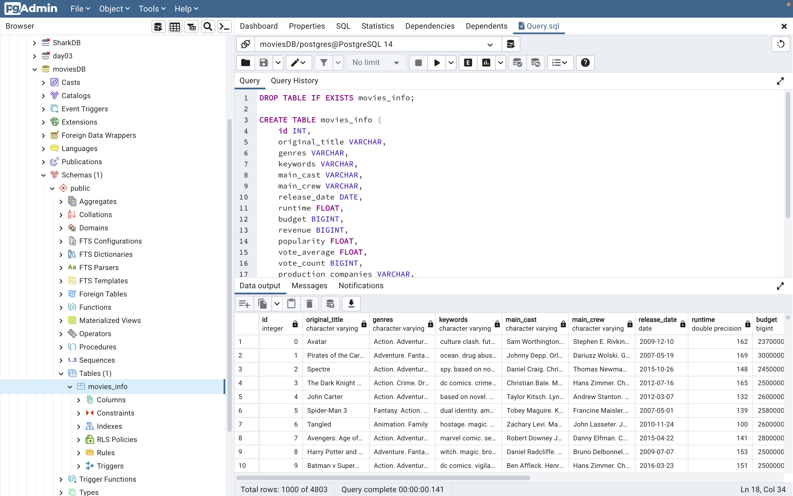

# Project: Movie Data Set ETL Process

Team Members:
- Angele Gueupi,
- Gary Groscost,
- Miranda Hermes,
- Chris Howard,
- Giovanna Lizzio,
- Preethi Vontela;

# Project Summary:
A production is interested in what kinds of movies to invest in, going forward. They hire a team of data analysts to look into how different movie attributes affect the popularity and revenue of the movies that people watch. This will help them know what movies to invest in going forward. 

# Project Outline:
The team project main focus was creating a dataset following the extract, transform, and load process (ETL). The team uploaded the data into the jupyter notebook via pandas, merging the two csv files, cleaning columns and loading the cleaned data into a PostgreSQL Database.

# Data Source:

Top 5000 Movie Data Set: https://www.kaggle.com/datasets/tmdb/tmdb-movie-metadata
We selected the following files from the Data Set:

- movies_metadata.csv: The main Movies Metadata file. Contains information on 45,000 movies featured in the Full MovieLens dataset. Features include posters, backdrops, budget, revenue, release dates, languages, production countries and companies.

- credits.csv: Consists of Cast and Crew Information for all our movies. Available in the form of a stringified JSON Object.

# ETL Process:

We imported the two CSV files into a Jupyter notebook utilizing Pandas. Then, we merged the two CSVs into one dataframe. The cleaning process consisted of renaming, merging, deleting and converting columns to make the data more usable for analysis. Finally, we exported the dataframe to a new csv file and migrated the cleaned data to a safe storage space via PostgreSQL.

*Pandas DataFrame*

*CSV File*

*PostgreSQL*

